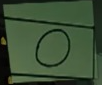
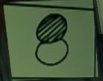
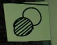
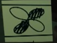

# bo6-terminus
 <!DOCTYPE html>
<html lang="pt-br">
<head>
    <meta charset="UTF-8">
    <meta name="viewport" content="width=device-width, initial-scale=1.0">
    <title>Seleção de Valores e Cálculo de Expressões</title>
    
</head>
<body>

    <h2>Seleção de Valores</h2>

    

        
Escolha o valor de x:

        

            <input type="radio" name="x" id="x0" value="0" checked>
            <label for="x0"></label>
            
            <input type="radio" name="x" id="x10" value="10">
            <label for="x10"></label>
            
            <input type="radio" name="x" id="x11" value="11">
            <label for="x11"></label>
            
            <input type="radio" name="x" id="x20" value="20">
            <label for="x20"></label>
            
            <input type="radio" name="x" id="x21" value="21">
            <label for="x21"></label>
            
            <input type="radio" name="x" id="x22" value="22">
            <label for="x22"></label>
        

    

    

        
Escolha o valor de y:

        

            <input type="radio" name="y" id="y0" value="0" checked>
            <label for="y0"></label>
            
            <input type="radio" name="y" id="y10" value="10">
            <label for="y10"></label>
            
            <input type="radio" name="y" id="y11" value="11">
            <label for="y11"></label>
            
            <input type="radio" name="y" id="y20" value="20">
            <label for="y20"></label>
            
            <input type="radio" name="y" id="y21" value="21">
            <label for="y21"></label>
            
            <input type="radio" name="y" id="y22" value="22">
            <label for="y22"></label>
        

    

    

        
Escolha o valor de z:

        

            <input type="radio" name="z" id="z0" value="0" checked>
            <label for="z0"></label>
            
            <input type="radio" name="z" id="z10" value="10">
            <label for="z10"></label>
            
            <input type="radio" name="z" id="z11" value="11">
            <label for="z11"></label>
            
            <input type="radio" name="z" id="z20" value="20">
            <label for="z20"></label>
            
            <input type="radio" name="z" id="z21" value="21">
            <label for="z21"></label>
            
            <input type="radio" name="z" id="z22" value="22">
            <label for="z22"></label>
        

    

    <button onclick="calcular()">Calcular</button>
    <button class="reset-button" onclick="resetar()">Resetar</button>

    

    

        <h4>Se você deseja apoiar meus estudos, considere fazer uma doação:</h4>
        <a href="https://www.paypal.com/donate/?business=G67QYHTLRP8U2&no_recurring=0&item_name=Support+my+studies+to+become+a+software+engineer&currency_code=BRL" target="_blank">Doar</a>
    

    
by: SmR

</body>
</html>

